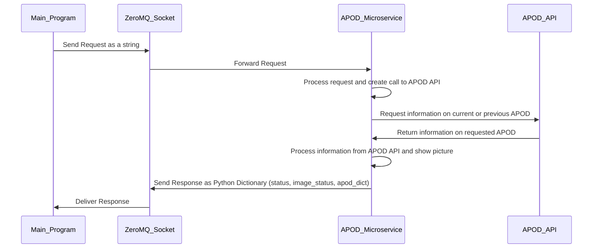
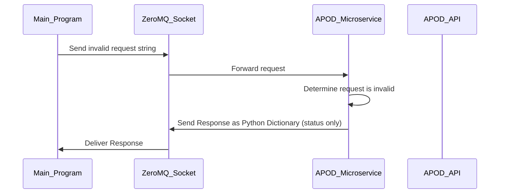

# APOD Microservice
This microservice provides information regarding current and previous versions of NASA's Astronomy Picture of the Day (APOD). This microservice shows the picture on the user's screen as the default behavior; this behavior can be switched off for any given call. 

# Setting Up ZeroMQ
The microservice communicates via a ZeroMQ socket set to a port defined in the .env file as `PORT_APOD`.

## Example Code: Setting up the ZeroMQ socket
```
from dotenv import load_dotenv
import os
import zmq

load_dotenv()
port_number = os.getenv("PORT_APOD")
context = zmq.Context()
socket = context.socket(zmq.REQ) 
socket.connect(f"tcp://localhost:{port_number}")
```

# Requesting Data
To request data, send a string using ZeroMQ. The string must be `4 [date] [text]` where the brackets indicate optional information. To clarify:

## Request String Content
* 4: The user in the main program types '4' to indicate that they would like to access the APOD service. This must be the first character of the request string.
* \[date\]: Optional. To obtain a previous APOD, the request string must contain a date in the format `YYYY-MM-DD`. If no date is provided, the current APOD will be obtained.
* \[text\]: Optional. If the word `text` appears in the query string, the APOD picture will not be shown on the user's screen. Showing the picture is the default behavior.

## Request String Examples
**Request String**: "4"  
**Result**: Today's APOD will be shown on screen; information about today's APOD will be returned to the user. 

**Request String:** "4 text"  
**Result**: Today's APOD will *not* be shown on screen; information about today's APOD will be returned to the user. 

**Request String:** "4 2005-11-23"  
**Result**: The APOD from Nov 23, 2005 will be shown on screen; information about that APOD will be returned to the user. 

**Request String:** "4 text 2005-11-23"  
**Result**: The APOD from Nov 23, 2005 will *not* be shown on screen; information about that APOD will be returned to the user. Note that the date and the word text can appear in any order but the "4" must be the first character in the request string.

## Example Code: Creating and sending a request string
```
request_string = input("What request string should I send? ")
socket.send_string(request_string)
```

# Receiving Data
The main program will receive a Python dictionary containing the status of the request, the status of the APOD image generation, and the information about that day's APOD as a Python Dictionary.

## Response Keys
* "status": This tells the end user whether a successful call to the APOD API has been made. In the case of an invalid request, this is the only response that will be returned.
* "image_status": This tells the end user whether the APOD image was successfully shown to the user's screen.
* "apod_dict": This contains a dictionary with keys corresponding to the information obtained from the APOD API. The keys are "date","explanation","title", and "url".

### Response Example for request string "4" on August 3, 2025:  
```
{
  "status": "success",
  "image_status": "Image Shown",
  "data": {
    'date': '2025-08-03', 
    'explanation': "In about a week the Perseid Meteor Shower will reach its maximum.  Grains of icy rock will streak across the sky as they evaporate during entry into Earth's atmosphere.  These grains were shed from Comet Swift-Tuttle.  The Perseids result from the annual crossing of the Earth through Comet Swift-Tuttle's orbit, and are typically the most active meteor shower of the year.  Although it is hard to predict the level of activity in any meteor shower, in a clear dark sky an observer might see a meteor a minute.  This year's Perseids peak just a few days after  full moon, and so some faint meteors will be lost to the lunar skyglow.  Meteor showers in general are best seen from a relaxing position, away from lights.  Featured here is a meteor caught exploding during the 2015 Perseids above Austria next to the central band of our Milky Way Galaxy.", 
    'title': 'Milky Way and Exploding Meteor', 
    'url': 'https://apod.nasa.gov/apod/image/2508/MeteorBoom_vanderHoeven_750.gif'
    }
}
```
### Response Example for request string "3"
```
{
  "status": "invalid request",
}
```

## Example Code: Receiving a Response
```
pyobj = socket.recv_pyobj()
if pyobj["status"] != "success":
    print(pyobj["status"])
else:
    print(pyobj["apod_dict"], pyobj["image_status"])
```
# UML Sequence Diagrams
## Success
The following is a UML sequence diagram showing the processes between the main program, the ZeroMQ Socket, this microservice, and the APOD API for a successful request/response cycle. 

## Invalid Response

The following is a UML sequence diagram showing the processes between the main program, the ZeroMQ Socket, this microservice, and the APOD API for a request/response cycle with an invalid request. 



# Other Useful Information 

## APOD API Key
To successfully run this microservice, you need a NASA API Key. You can obtain one for free [here](https://api.nasa.gov/).

## .ENV File
For apod_service.py to successfully run, you will need to create a .env file. There is no .env file in this repo so that no one will accidentally save their API key to github. The APOD API key for the .env file is the NASA API key you can generate in the previous step. 
```
APOD_API_KEY=<insert your APOD key here>
PORT_APOD=<insert your port number here>
```

## Imports
Imports will be necessary to use this project successfully; this project was created using the most recent version of each import as of July 31, 2025. Any imports you may need for this program should be available via Python's packaget installer, pip. Please reach out if you have an issue.
